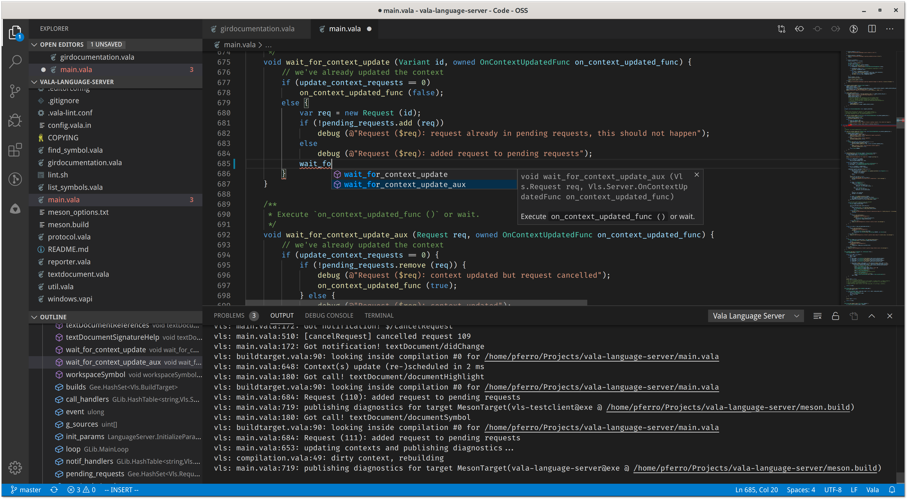

# vala-vscode - Vala support for Visual Studio Code

## Syntax highlighting and code intelligence for the Vala / Genie languages

---

---

This extension is based off of the `vala-code` extension by T. Abreu (https://github.com/thiagoabreu) and the `vala-grammar` extension by Jereme Philippe (https://github.com/philippejer/vala-grammar).

---

## Further Setup

`vala-vscode` provides syntax color-coding out of the box, but it requires the [Vala Language Server](https://github.com/benwaffle/vala-language-server) (https://github.com/benwaffle/vala-language-server) in order to provide inline VS Code Problem (Error/Warning) highlighting (i.e. yellow and red squiggly underlines, AKA code intelligence).

To install `vala-language-server`:

- Arch Linux (via AUR): `yay -S vala-language-server`
  or `yay -S vala-language-server-git`
- Ubuntu, Fedora, Debian, openSUSE, and Mageia: install from [the OBS repo](https://software.opensuse.org//download.html?project=home%3APrince781&package=vala-language-server)
- elementaryOS: `sudo apt install vala-language-server`
- Alpine Linux: `apk add vala-language-server`
- Guix: `guix install vala-language-server`

Instructions for building `vala-language-server` for other platforms can be found on the [Vala Language Server GitHub Page](https://github.com/benwaffle/vala-language-server) (https://github.com/benwaffle/vala-language-server)

> Note that if you have any Vala projects open in VS Code when you install `vala-language-server`, you may need to close and reopen the VS Code project window in order for `vala-vscode` to autodetect the installation path for `vala-language-server`.

---

## How to edit the rules

The YAML source file should be edited and then converted to XML with the "TextMate Languages" extension (https://marketplace.visualstudio.com/items?itemName=Togusa09.tmlanguage).

Note that this plugin has an issue which interacts badly with language servers (false syntax errors), so it is a good idea to disable it afterwards.
