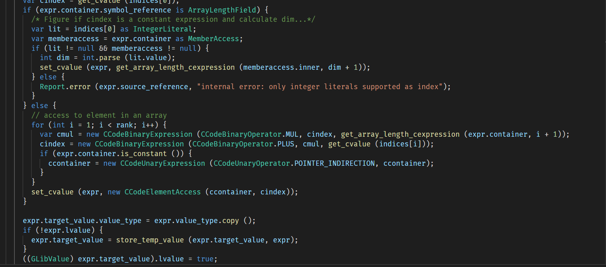

# Vala Grammar

## Syntax highlighting for the Vala / Genie languages

---

---

This extension started as a fork of the `vala-code` extension by T. Abreu (https://github.com/thiagoabreu).

However, in trying to improve the rules, I have found myself removing most of the complex hierarchical parsing rules to keep only a handful of basic stateless rules.

So the grammar rules are extremely simple but work well in practice for both Vala and Genie (the YAML grammar is ~100 lines vs. ~3000 lines for the typescript one).

The price to pay for this simplicity is that the the code should follow these (very common) naming conventions:

- Types are either `snake_case` (only for built-in types) or `PascalCase` (classes, structs, enums and errors).
- Variables, fields and methods are `snake_case`.
- Constants are `UPPER_SNAKE_CASE`.

Also, while the grammar works fine with the default VSCode theme (Dark+), it is very coarse grained so it might not work as well with a more complex theme.

## How to edit the rules

The YAML source file should be edited and then converted to XML with the "TextMate Languages" extension (https://marketplace.visualstudio.com/items?itemName=Togusa09.tmlanguage).

Note that this plugin has an issue which interacts badly with language servers (false syntax errors), so it is a good idea to disable it afterwards.
